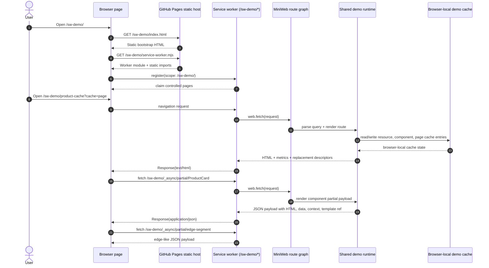
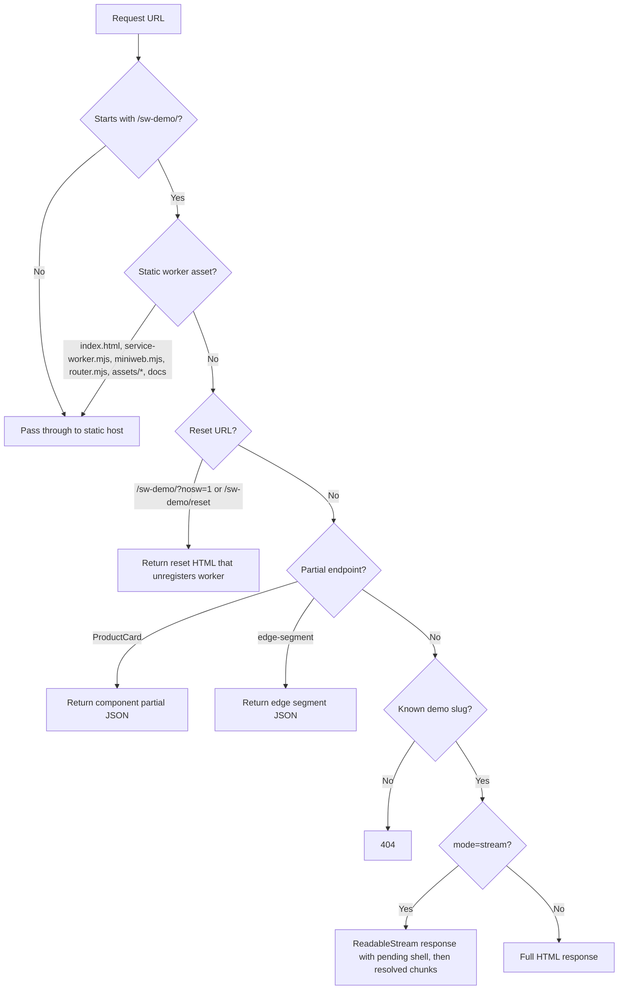
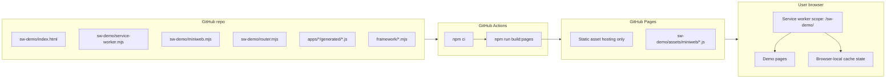

# GitHub Pages Backend Emulation

The GitHub Pages version is static, but the browser installs a service worker that handles demo routes under `/sw-demo/*` with MiniWeb assets generated from the installed `@async/miniweb` package during the Pages build.

The worker is not a real shared backend. It is a browser-local MiniWeb backend emulator for the demo contract: query-driven pages, partial JSON endpoints, cache counters, resource delays, and stream-like replacement chunks.

By default the MiniWeb app runs in the same realm. Add `runtime=iframe` to a demo URL to run the MiniWeb app through its iframe runtime boundary; the page surfaces the selected mode in the execution metrics and the worker adds `x-async-framework-demo-miniweb-runtime`.

## Request Flow

## Route Decision

## What Is Real vs Emulated

| Surface | Node server demo | GitHub Pages service-worker demo |
| --- | --- | --- |
| Static files | Served by Node | Served by GitHub Pages |
| Route handling | `server.mjs` | `sw-demo/service-worker.mjs` -> `sw-demo/miniweb.mjs` -> `sw-demo/router.mjs` |
| Query-param rendering | Real server request | Worker navigation request |
| MiniWeb runtime mode | N/A | `same-realm` by default, `runtime=iframe` opt-in |
| In-memory cache | Node process memory | Browser service-worker memory |
| Partial endpoint | `/_async/partial/ProductCard` | `/sw-demo/_async/partial/ProductCard` |
| Edge endpoint | `/_async/partial/edge-segment` | `/sw-demo/_async/partial/edge-segment` |
| Delays | Node timers | Worker timers |
| Streaming | Node HTTP response stream | Worker `ReadableStream` response |
| Shared backend state | Yes, per Node process | No, per browser install |
| Deployment target | Node host | GitHub Pages |

## Static Deployment Shape

## Why This Works For Demos

The server behavior is intentionally small and deterministic:

- parse query params
- render HTML from generated demo modules
- return two JSON partial endpoints
- keep simple cache state
- wait with timers to mimic resource latency
- stream replacement chunks in demo order

That maps cleanly to MiniWeb plus a service worker because the worker can pass a real `Request` through a browser-local route graph and return `Response` objects directly. The limitation is that the worker cannot prove multi-user backend behavior. It proves the demo route contract and the UI behavior on static hosting.

## Debugging Stale Workers

Use either path:

- `/sw-demo/debug` checks the installed controller, worker version, and partial endpoint responses.
- `/sw-demo/?nosw=1` unregisters the worker and clears demo caches.

When changing worker code, bump `DEMO_SW_VERSION` in `sw-demo/router.mjs` so the debug page can show which worker version is active.
